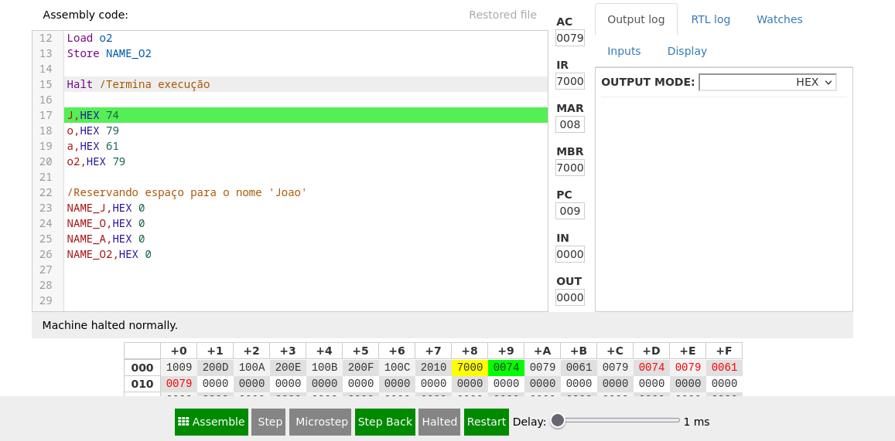

# Atividades desenvolvidas em Assembly

## Atividade-1

Q - Como funciona a alocação de memória dinâmica para armazenar seu nome.

R - Ele aloca a memória ocupando o primeiro lugar vago para que seja inserido o valor do campo solicitado, onde caso ele encontre o armazenamento necessário fará a inserção dos mesmos no endereço de memória.

```
ORG 000 ;Inicia o programa no endereço 000


;Preparação para alocar as letras em memória
Load J ;Realiza o load da variável, onde nos demais representa a mesma função
Store NAME_J ;Produz um local para armazenamento das variáveis futuramente e serem impressas nos locais de memória

Load o
Store NAME_O

Load a
Store NAME_A

Load o2
Store NAME_O2

Halt ;Termina execução

J,HEX 74
o,HEX 79
a,HEX 61
o2,HEX 79

;Reservando espaço para o nome 'Joao'
NAME_J,HEX 0
NAME_O,HEX 0
NAME_A,HEX 0
NAME_O2,HEX 0
```

## Código produzido no marie.js.org


## Atividade-2 

### Solicitado
Subir o código (comentado)

Explicar o funcionamento dos registradores → Os registradores são os locais da CPU no qual é realizado o armazenamento e manipulação dos dados.

```
;Dos em assembly (MASM/TASM*)

.MODEL small ;Definição de modelo de memória
.STACK 64 ;Aloca um espaço de 64 byres para a pilha (Correspondendo ao processador)

.DATA ;Inicio da  seção de dados

message db 'Soldador', '$'; Define uma mensagem e termina com $

.CODE ;Inicio da seção de código

main proc ;Define o inicio do procedimento principal

mov ax, @data ;Carrega o enderço do segmento em AX 
mov ds, ax ;Move o valor em AX para o registrador DS (segmento de dados)

mov ah, 9h ;Preparando o registrador AH para a função 09h do DOS
mov dx, offset message ;Vai fazer o shift(deslocamento) da mensagem em DX

int 21h ;Instrução de interrupeção

main endp ;Marca o fim do procedimento
end main ;Indica o fim
```